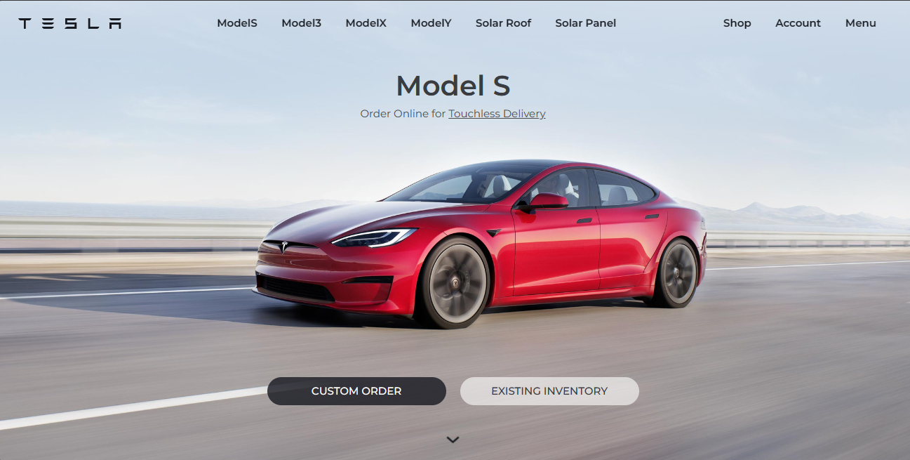

# Tesla Website Clone

This is a clone of the Tesla website's homepage built using HTML and Tailwind CSS.

## Description

The Tesla Website Clone project aims to recreate the homepage of the Tesla website using HTML for structure and Tailwind CSS for styling. It includes sections for different Tesla car models and solar energy products.

## Preview




## Features

- Responsive design for various screen sizes.
- Smooth scrolling navigation.
- Custom styling using Tailwind CSS.

## Installation

1. Clone the repository:

   ```bash
   git clone https://github.com/munirahmad9959/tesla-website-clone.git

## Usage
   * Click on the navigation links to scroll to different sections of the page.
   * Explore the different Tesla car models and solar energy products showcased on the homepage.

## Contributing
   Contributions are welcome! Feel free to submit pull requests or open issues for any improvements or fixes.

## License
   This project is licensed under the MIT License - see the LICENSE file for details.


